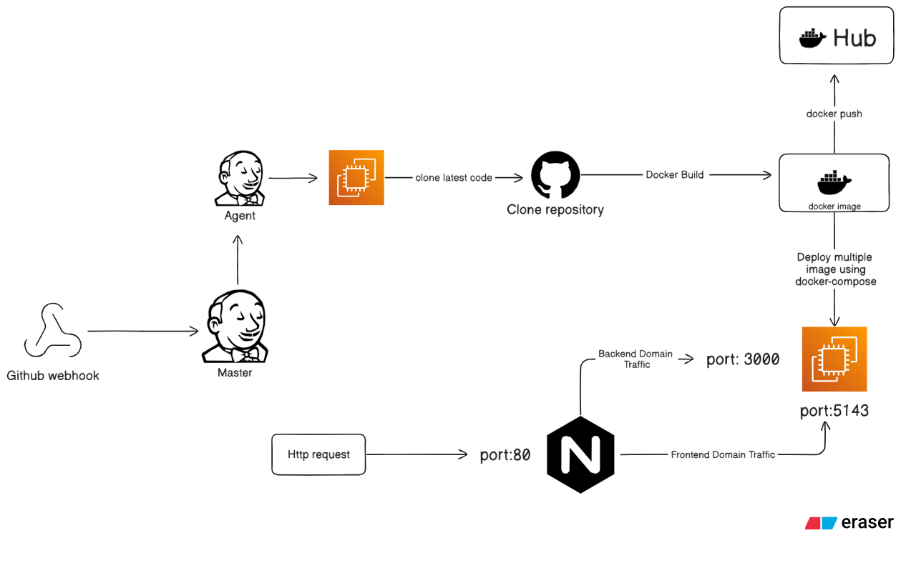

# distributed-cicd-pipeline-jenkins-docker
This project implements an end-to-end CI/CD pipeline for a distributed 3-tier full-stack web application using Jenkins and Docker. The pipeline is automatically triggered via a GitHub Webhook whenever code is pushed to the repository.

Upon receiving the webhook event, the Jenkins Master initiates the pipeline execution on a Jenkins Agent. The agent clones the latest code, builds and versions Docker images, securely injects environment variables, pushes images to Docker Hub, and deploys the frontend and backend services using Docker Compose.

The deployment is hosted on AWS EC2 and follows a production-like setup. NGINX is configured as a reverse proxy to route incoming traffic to the appropriate services based on domain names, enabling multiple applications to run on a single EC2 instance.

## Architecture Overview

The CI/CD pipeline follows a webhook-driven, multi-node Jenkins architecture:

- A GitHub Webhook triggers the pipeline on every code push
- Jenkins Master receives the webhook and orchestrates the pipeline
- Jenkins Agent clones the updated repository
- Docker images are built and versioned on the agent
- Images are pushed to Docker Hub
- Docker Compose deploys the containers on AWS EC2
- NGINX acts as a reverse proxy to route traffic based on domain names to specific application ports

